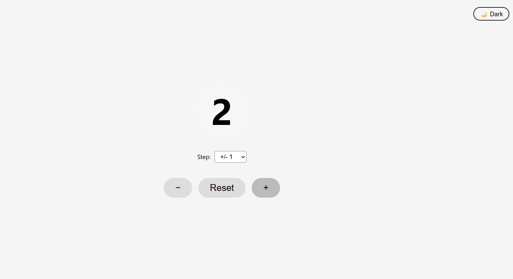
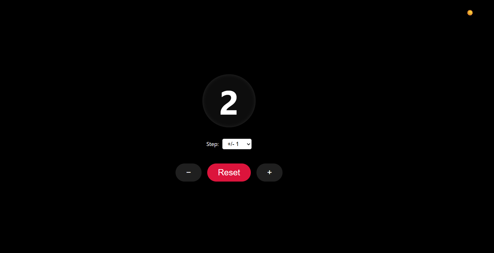

# 🧮 React Counter App (With Dark Mode & Reset)

Hi everyone! 👋  
This is a simple but slightly enhanced React Counter App I built while practicing React basics. It’s perfect for beginners who want to gain hands-on experience with hooks like `useState` and experiment with styling and adding small features.

---

## 💡 What's Included

✅ Increase & decrease the count  
🔁 Reset the counter to `0`  
🌗 Light/Dark theme toggle  
🔢 Count number with animation effect  
💻 Clean and responsive layout  
🎨 Buttons with hover and transition effects  

---

## 📚 What I Learned

- Using `useState` in React  
- Handling button click events  
- Conditional styling (themes)  
- Adding CSS animations and transitions  
- Writing clean and beginner-friendly React components  

---

## 🛠️ Tech Used

- React.js (with Hooks)  
- Vite (for fast setup)  
- Vanilla CSS (no external libraries)  

---
## 🖼️ Screenshots

  
*Light Mode*

  
*Dark Mode*


---

## 🚀 How to Run Locally

If you want to run this project locally on your system, follow these steps:

```bash
# 1. Clone the repository
git clone https://github.com/nehabvp288/react-counter-app.git

# 2. Move into the project directory
cd react-counter-app

# 3. Install all dependencies
npm install

# 4. Start the development server
npm run dev
```

Then, open your browser and go to:  
👉 `http://localhost:5173`

---

## 🎯 Why This Project?

I'm planning to keep a folder where I’ll continue adding small, beginner-friendly React projects like this one.  
The idea is to help others get comfortable with React basics through simple hands-on examples.

So stay tuned — more projects coming soon! 😊

---

## 📬 Connect With Me

**Neha Joshi**  
Frontend Developer | React | UI/UX  
📍 Bangalore, India  
📧 nehabvp28@gmail.com  

🔗 [LinkedIn](https://www.linkedin.com/in/neha-joshi-722b29257/)  
🔗 [GitHub](https://github.com/nehabvp288)
